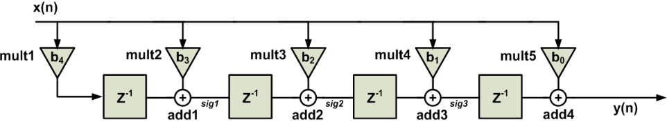

# Digital Implementation of FIR Filters

## Introduction

- A **filter** is an LTI system designed to pass a set of desired frequency components from a mixture of desired and undesired components.
- **Finite Impulse Response (FIR) Filters**:
  - Always stable.
  - No feedback → no poles.
- For FIR systems, the filter coefficients are equal to the impulse response:
  $$
  y[n] = \sum_{k=0}^{M} b_k x[n-k] = \sum_{k=0}^{M} h[k] x[n-k]
  $$
- Focus on **causal, linear phase Type I FIR filter**.

### Practical Filters

- Practical filters differ from ideal filters:
  1. Passband responses are not perfectly flat.
  2. Stopband responses cannot completely reject bands of frequencies.
  3. Transition between passband and stopband regions takes place over a finite transition band.

---

## Design of FIR Filters

### Specifications

- Design a lowpass FIR filter with the following specifications:
  - Passband Frequency (\( \omega_p \)): \( 0.25\pi \)
  - Stopband Frequency (\( \omega_s \)): \( 0.35\pi \)
  - Passband Ripple (\( A_p \)): 0.1 dB
  - Stopband Attenuation (\( A_s \)): 50 dB

### Window Method

- The impulse response of the ideal filter is truncated by multiplying it by a window function:
  $$
  h[n] = h_d[n] w[n] = \frac{\sin(\omega_c (n - \alpha))}{\pi (n - \alpha)} w[n]
  $$

#### Standard Windows

- Determine \( \delta_p \) and \( \delta_s \) from \( A_p \) and \( A_s \):
  $$
  \delta_p = \frac{10^{\frac{A_p}{20}} - 1}{10^{\frac{A_p}{20}} + 1} = 5.756 \times 10^{-3}
  $$
  $$
  \delta_s = \frac{1 + \delta_p}{10^{\frac{A_s}{20}}} = 3.18 \times 10^{-3}
  $$
- Determine the cutoff frequency \( \omega_c \):
  $$
  \omega_c = \frac{\omega_p + \omega_s}{2} = 0.3\pi
  $$
- Choose a window with the smallest stopband attenuation greater than \( A \) → **Hamming Window**.
- Determine \( L \):
  $$
  0.1 \pi = \frac{6.6 \pi}{L} \rightarrow L = 66
  $$
- Change Type II to I by increasing the length by 1:
  $$
  L = 66 + 1 = 67 \quad M = L - 1 = 66 \quad \alpha = M/2 = 33
  $$

#### Kaiser Window

- Kaiser window has a parameter \( \beta \) to control the trade-off between mainlobe width and sidelobe level.
- From Kaiser's empirical formulas:
  $$
  \beta = 4.528 \quad M = 59
  $$
- Change to Type I → \( M = 60 \), \( L = 61 \), \( \alpha = 30 \).

### Equiripple Optimum Chebyshev Method

- Minimizes the maximum error between the ideal and actual frequency responses.
- Uses the **Parks-McClellan algorithm** (Remez exchange algorithm).

- Estimate \( M \) using Kaiser's formula:
  $$
  M = \frac{-20 \log_{10}(\delta_p \delta_s)^{0.5} - 13}{2.324 \Delta \omega} = 48
  $$
- Using Remez function in Python, \( L = 49 \), \( alpha = 24 \).

### Comparison

- **Window Method**: Easier to implement but requires more taps.
- **Equiripple Method**: Provides fewer taps for the same specifications.

| Method           | Length |
|------------------|--------|
| Window (Hamming) | 67     |
| Window (Kaiser)  | 61     |
| Equiripple       | 49     |

---

## Digital Implementation

### Architectures

- **Direct Form**: Simple but limits maximum clock frequency.
- **Transposed Form**: Achieves higher clock frequencies.

### Folding

- Due to symmetry of linear phase filter coefficients, use half the number of multipliers.
- Example:
  $$
  y[n] = b_0 (x[n] + x[n-4]) + b_1 (x[n-1] + x[n-3]) + b_2 x[n-2]
  $$

## Verification

### CORDIC

- Generate sine and cosine values using CORDIC IP.
- Output frequency:
  $$
  F_{out} = \frac{2 \pi M F_{clk_{cordic}}}{2^{N -1}}
  $$

### Test Strategy

- FIR frequency: 30.72 MHz
- CORDIC frequency: 100 MHz
- Test cases:
  1. 0.5 MHz + 1 MHz → Both pass.
  2. 1 MHz + 8 MHz → Only 1 MHz passes.
  3. 6 MHz + 7 MHz → Both attenuated.

---

## FPGA Implementation

### Synthesis

- RTL compatible with both ASIC and FPGA.
- FPGA provides dedicated DSP blocks for MAC operations.

### Elaboration

- **Fixed Coefficients**: No registers needed for coefficients.
- **Reloadable Coefficients**: Coefficients stored in flip-flops.

### Synthesis Results

- **Kaiser Window Filter (61 taps)**:
  
- **Equiripple Filter (49 taps)**:
  

---

## Optimization

### Vivado FIR Compiler IP

- Optimize design by using Vivado's FIR Compiler IP.
- Configure input sampling frequency and clock frequency for resource optimization.

### Comparison

- **Clock Frequency**: 100 MHz
- **Sampling Frequency**: 44.1 KHz vs. 100 MHz

---

## References

1. Dimitris Manolakis, Vinay Ingle, Stephen Kogon, "Applied Digital Signal Processing", Cambridge University Press, 2011.
2. Dr. Michael Ibrahim, "Digital Signal Processing", Lecture Notes ([YouTube Playlist](https://www.youtube.com/playlist?list=PLn8PRpmsu08pQBgjxYFXSs3JZ1jJ5J4g_)).
3. Verification using CORDIC ([YouTube Video](https://youtu.be/RvvOLhBH7-k?si=aLO5mTJ4wiBkYl-k)).
4. Yaseen Salah's FIR Implementation ([GitHub](https://github.com/yaseensalah/Digital-Design-of-FIR-Filter)).
5. Equiripple Filters ([YouTube Video](https://youtu.be/nmYsTs-TRyE?si=2y_NyToNJQ8StUkH))
