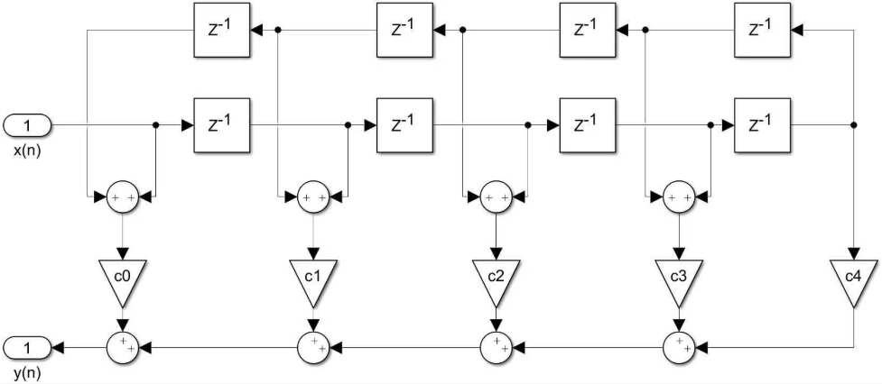
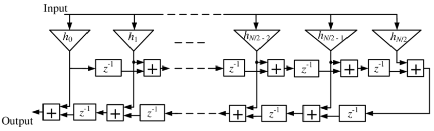

# Digital Implementation of FIR Filters

## Introduction

- A **filter** is an LTI system designed to pass a set of desired frequency components from a mixture of desired and undesired components.
- **Finite Impulse Response (FIR) Filters**:
  - Always stable.
  - No feedback → no poles.
- For FIR systems, the filter coefficients are equal to the impulse response:
  $$
  y[n] = \sum_{k=0}^{M} b_k x[n-k] = \sum_{k=0}^{M} h[k] x[n-k]
  $$
- Focus on **causal, linear phase Type I FIR filter**.

### Practical Filters

- Practical filters differ from ideal filters:
  1. Passband responses are not perfectly flat.
  2. Stopband responses cannot completely reject bands of frequencies.
  3. Transition between passband and stopband regions takes place over a finite transition band.

---

## Design of FIR Filters

### Specifications

- Design a lowpass FIR filter with the following specifications:
  - Passband Frequency ($ \omega_p $): $ 0.25\pi $
  - Stopband Frequency ($ \omega_s $): $ 0.35\pi $
  - Passband Ripple ($ A_p $): 0.1 dB
  - Stopband Attenuation ($ A_s $): 50 dB

### Window Method

- The impulse response of the ideal filter is truncated by multiplying it by a window function:
  $$
  h[n] = h_d[n] w[n] = \frac{\sin(\omega_c (n - \alpha))}{\pi (n - \alpha)} w[n]
  $$

#### Standard Windows

- Determine $ \delta_p $ and $ \delta_s $ from $ A_p $ and $ A_s $:
  $$
  \delta_p = \frac{10^{\frac{A_p}{20}} - 1}{10^{\frac{A_p}{20}} + 1} = 5.756 \times 10^{-3}
  $$
  $$
  \delta_s = \frac{1 + \delta_p}{10^{\frac{A_s}{20}}} = 3.18 \times 10^{-3}
  $$
- Determine the cutoff frequency $ \omega_c $:
  $$
  \omega_c = \frac{\omega_p + \omega_s}{2} = 0.3\pi
  $$
- Determine the design parameters:
  $$
  A = -20 \log_{10} \text{min}(\delta_p, \delta_s) = 49.95
  $$
  $$
  \Delta \omega = \omega_s - \omega_p = 0.1\pi
  $$
- Choose a window with the smallest stopband attenuation greater than $ A $ → **Hamming Window**.
- Determine $ L $:
  $$
  0.1 \pi = \frac{6.6 \pi}{L} \rightarrow L = 66
  $$
- Change Type II to I by increasing the length by 1:
  $$
  L = 66 + 1 = 67 \quad M = L - 1 = 66 \quad \alpha = M/2 = 33
  $$

#### Kaiser Window

- Kaiser window has a parameter $ \beta $ to control the trade-off between mainlobe width and sidelobe level.
- From Kaiser's empirical formulas:
  $$
  \beta = \begin{cases}
      0.1102(A - 8.7) & \text{if } A > 50 \\
      0.5842(A - 21)^{0.4} + 0.07886(A - 21) & \text{if } 21 \leq A \leq 50 \\
      0 & \text{if } A < 21
  \end{cases}
  $$
  $$
  \beta = 0.1102(49.95 - 8.7) = 4.528
  $$
  $$
  M = \frac{A - 8}{2.285 \Delta \omega} = \frac{49.95 - 8}{2.285 \times 0.1\pi} = \frac{41.95}{0.7176} = 58.46 \approx 59
  $$
- Change to Type I → $ M = 60 $, $ L = 61 $, $ \alpha = 30 $.

## Equiripple Optimum Chebyshev Method

### Chebyshev Approximation

- This method minimizes the maximum error between the ideal and actual frequency responses.
- Define:
    - $A_d(\omega)$: The desired frequency response.
    - $A(\omega)$: The actual frequency response.
    - $W(\omega)$: The weighting function.
    - $E(\omega)$: The error function.
- Minimize $E(\omega)$:
    $$
    E(\omega) = W(\omega) [A_d(\omega) - A(\omega)]
    $$
- The Remez exchange algorithm is used to solve these kinds of problems.
- The Parks-McClellan algorithm is a specific application of the Remez exchange algorithm, tailored for designing FIR filters with linear phase.

### Parks-McClellan Algorithm

- Read more about the algorithm in section 10.6.3 in [1].

- Obtain $M$ using Kaiser's formula:
    $$
    M = \frac{-20 \log_{10}(\delta_p \delta_s)^{0.5} - 13}{2.324 \Delta \omega} = 48
    $$
- Check if it achieves the desired specifications. If not, increase $M$ and repeat the process.
- Using the Remez function in Python, the specifications are met, so $L = 49$ and $\alpha = 24$.

### Equiripple Filter

- Notice how the ripples in the passband and stopband are equal.

### Comparison

- The window method is easier to implement and understand, but the equiripple method provides a smaller number of taps for the same specifications.

| Method           | Length |
|------------------|--------|
| Window (Hamming) | 67     |
| Window (Kaiser)  | 61     |
| Equiripple       | 49     |

- The Python code calculates the filter coefficients and edits the System Verilog Code directly as well as creates the .coe file.

## Digital Implementation

### Architecture

- **Direct Form** architecture is the simplest and most intuitive, but the highlighted path limits the maximum clock frequency.

- **Transposed Form** architecture achieves higher clock frequencies.

### Folding

- Due to the symmetry of linear phase filter coefficients ($b_k = b_{M-k}$), we can use half the number of multipliers.
- Also, we only need to store almost half the number of coefficients.
- For example:
    $$
    y[n] = b_0 x[n] + b_1 x[n-1] + b_2 x[n-2] + b_3 x[n-3] + b_4 x[n-4] \\
    \Downarrow \quad \quad \quad \quad \quad \quad \quad \quad \quad \quad \quad \quad \quad \\
    y[n] = b_0 (x[n] + x[n-4]) + b_1 (x[n-1] + x[n-3]) + b_2 x[n-2]
    $$

- Direct Form

- Transposed Form

### Code

- **Fixed Coefficients**:
    - Coefficients are fixed, so they can be optimized reducing area and pins.
    - Suitable for some audio applications.

- **Reloadable Coefficients**:
    - Coefficients can be changed during runtime, so they are stored in a memory block, where we can write to it.
    - Suitable for audio equalizers.

- Use the compiler directives to switch between the two modes.

- Full code on GitHub: [\underline{link}](https://github.com/a-emad-hanna/FIR_Filter)

## Verification

### CORDIC

- We can store sampled sin wave values in a text file and read them in the testbench or use CORDIC IP to generate the values.
- Coordinate Rotation Digital Computer (CORDIC) uses an input phase angle to calculate the sine and cosine of the angle.
- The output frequency is given by:
    $$
    F_{out} = \frac{2 \pi M F_{clk_{cordic}}}{2^{N -1}}
    $$
    where
    - $M$: Phase accumulator value.
    - $F_{clk_{cordic}}$: CORDIC clock frequency.
    - $N$: Number of bits in the phase accumulator.

### Test Strategy

- The FIR frequency is set to 30.72MHz and the CORDIC frequency is set to 100MHz.
- $F_c = 0.15 F_s = 4.608$ MHz.
- I have created 3 test cases by adding sin waves with different frequencies.
    - 0.5 MHz + 1 MHz $\longrightarrow$ Both pass.
    - 1 MHz + 8 MHz $\longrightarrow$ Only the 1 MHz pass.
    - 6 MHz + 7 MHz $\longrightarrow$ Both attenuated.

### Waveforms

- The output of the equiripple FIR filter with 49 taps.

### Simulink Model

- "importhdl" is used to import the FIR filter HDL code into Simulink, but System Verilog is not supported, so we will make the Python script generate the Verilog code.
- Testing Strategy:
    - $F_s = 100$ KHz.
    - $\omega_c = 0.3 \pi \longrightarrow f_c = 0.15 F_S = 15$ KHz
    - Input is 2 KHz + 30 KHz $\longrightarrow$ only 2 KHz pass.

### Waveforms (Simulink)

## FPGA Implementation

### Synthesis

- RTL compatible with both ASIC and FPGA.
- FPGA provides dedicated DSP blocks for MAC operations.

### Elaboration

- **Fixed Coefficients**: No registers needed for coefficients.

- **Reloadable Coefficients**: Coefficients stored in flip-flops.

### Synthesis Results

- **Kaiser Window Filter (61 taps)**:
  
- **Equiripple Filter (49 taps)**:
  

---

## FPGA Implementation

### Synthesis

- The RTL is compatible with both ASIC and FPGA implementation flows.
- We will use FPGA, as it typically provides dedicated DSP blocks optimized for multiply-accumulate (MAC) operations.

### Elaboration

- For fixed coefficients, no registers are needed for the coefficients.

### Elaboration

- For reloadable coefficients, the coefficients are stored in flip-flops.

### Synthesis

- I will continue with the fixed coefficients design.

### Synthesis

- We can use attributes to further optimize the design.
- We will use `(* use_dsp48 = "yes" *)` to improve DSP slices utilization.

### Synthesis

- For equiripple filter, the tool was able to automatically utilize the DSP slices without the need for attributes.

### Constraints

- All the previous results were obtained using XC7VX485TFFG1157-1, but I will continue with Boolean XC7S50CSGA324-1 and 30.72 MHz clock.

### Device

### Reports

## Optimization

### Vivado FIR Compiler IP

- We can further optimize the design by using Vivado's FIR Compiler IP.

### Advantages

- A major advantage of using the IP is the ability to configure both the input sampling frequency and the clock frequency.
- By setting a low input sampling frequency while maintaining a high clock frequency, the design can optimize resource utilization.
- This allows a single DSP slice to perform multiple MAC operations before the next input sample arrives, effectively reducing the total number of DSP slices required.
- Let's test with a clock frequency of 100 MHz and a sampling frequency of 44.1 KHz & 100 MHz.

### Comparison

### Comparison

### Comparison

- Note that using more DSP slices instead of LUTs does not necessarily mean a better design especially for fixed coefficients.
- DSP slices might be needed by more critical parts of the design so you might have to save them if the FPGA is resource constrained.

### References

- [1] Dimitris Manolakis, Vinay Ingle, Stephen Kogon, "Applied Digital Signal Processing", Cambridge University Press, 2011.
- [2] Dr. Michael Ibrahim, "Digital Signal Processing", Lecture Notes ([link](https://www.youtube.com/playlist?list=PLn8PRpmsu08pQBgjxYFXSs3JZ1jJ5J4g_)).
- [3] Verification using CORDIC ([YouTube Video](https://youtu.be/RvvOLhBH7-k?si=aLO5mTJ4wiBkYl-k)).
- [4] Yaseen Salah's FIR Implementation ([link](https://github.com/yaseensalah/Digital-Design-of-FIR-Filter)).
- [5] Equiripple Filters ([YouTube Video](https://youtu.be/nmYsTs-TRyE?si=2y_NyToNJQ8StUkH)).